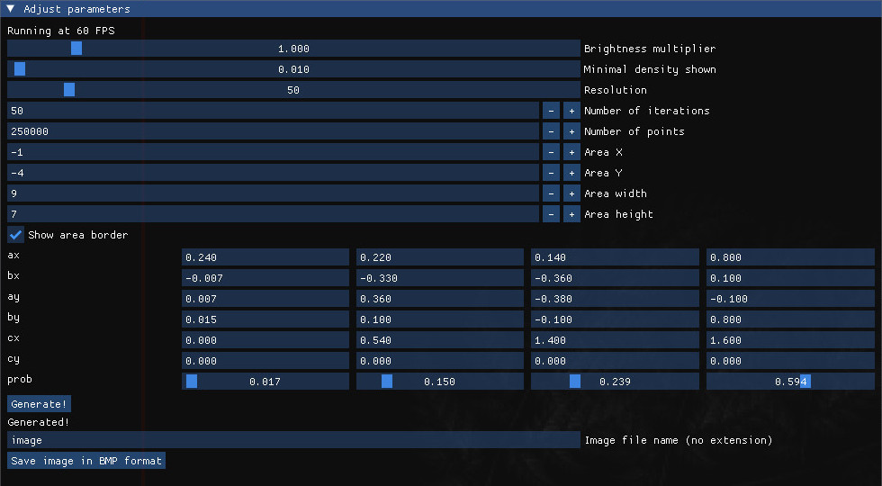

# fraktale-obrazy
A simple program written in C++ using SDL2, which lets you generate and save images of fractals.

## Installation
Clone this github repo: `git clone https://github.com/bwegrzyn0/fraktale-obrazy` and run the program with `./run.out`.

## Usage 
You will be met with the following interface inside the window:

