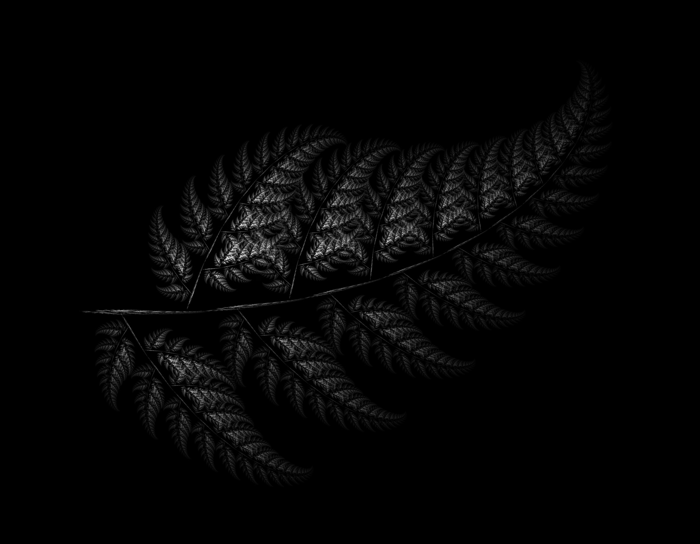
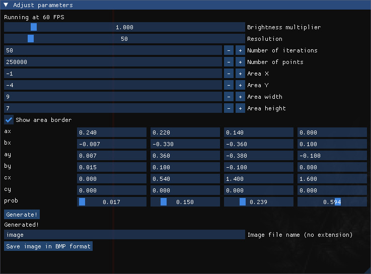

*An image generated with the program*
# fraktale-obrazy
A simple program written in C++ using SDL2, which lets you generate and save images of fractals.

> [!NOTE]
> This is just a small project of mine that grew a bit. The program may be buggy and inefficient.

## Installation
Clone this github repo: `git clone https://github.com/bwegrzyn0/fraktale-obrazy` and run the program with `./run.out`.

## Usage 
You will be met with the following interface inside the window:



It is best for you to try each of the options yourself to see what they do. I will skim through all of them here, though:
- __Brightness multiplier__: multiplies the brightness of all pixels by a given value. The brightest pixels (with value 255) will be unaffected.
- __Minimal density shown__: for the sake of efficiency, you can set the minimal brightness a pixel must have to be rendered. The default value will usually be good enough.
- __Resolution__: the number of pixels per unit of size. For example, if your area width is 10 and resolution is 100, the final image width will be 10*100=1000. Very high values will cause the framerate to drop significantly.
- __Number of iterations__: the number of iterations of the IFSP algorithm.
- __Number of points__: the number of points fed into the IFSP algorithm.
- __Area X and Area Y__: the X and Y coordinates of the area in which the fractal will be generated.
- __Area width and Area height__: the width and height of the area in which the fractal will be generated.
- __Show area border__: lets you toggle the red border around the area.
- __Transformation parameters__: you can have 4 transformations at most. Each of them is characterized by 7 parameters. The general formula for a transformation is
  ```
  transformed_x = a_x * x + b_x * y + c_x
  transformed_y = a_y * x + b_y * y + c_y
  ```
  Each transformation also has its own probability, which doesn't affect the shape of the attractor. It only affects the density of points on it.
- __Image file name__: the name of the image file (without extension).

Images are saved as `.bmp` files in the directory where the program had been launched.

  
  
  
  
